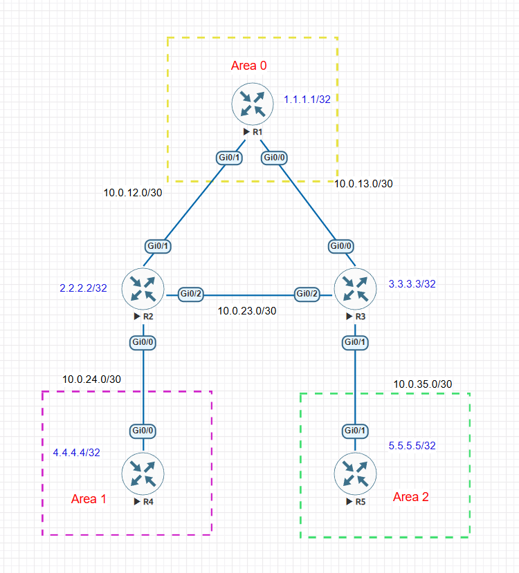
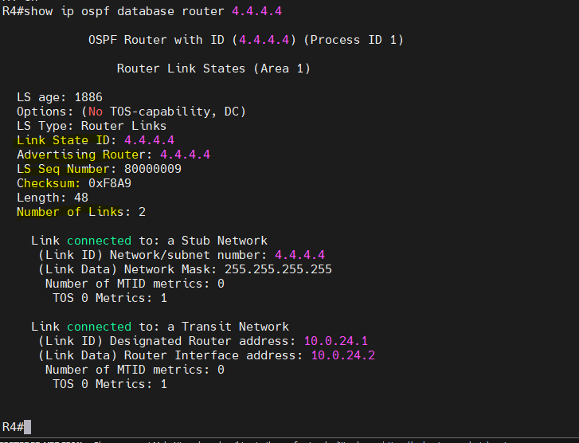
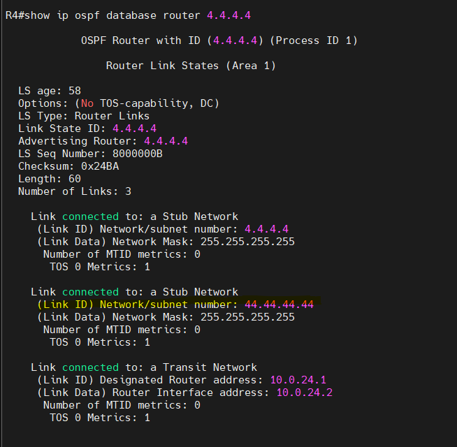
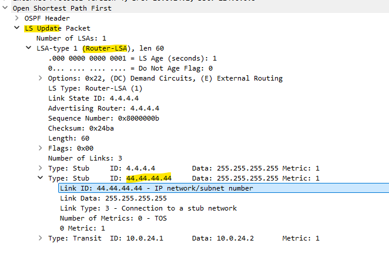
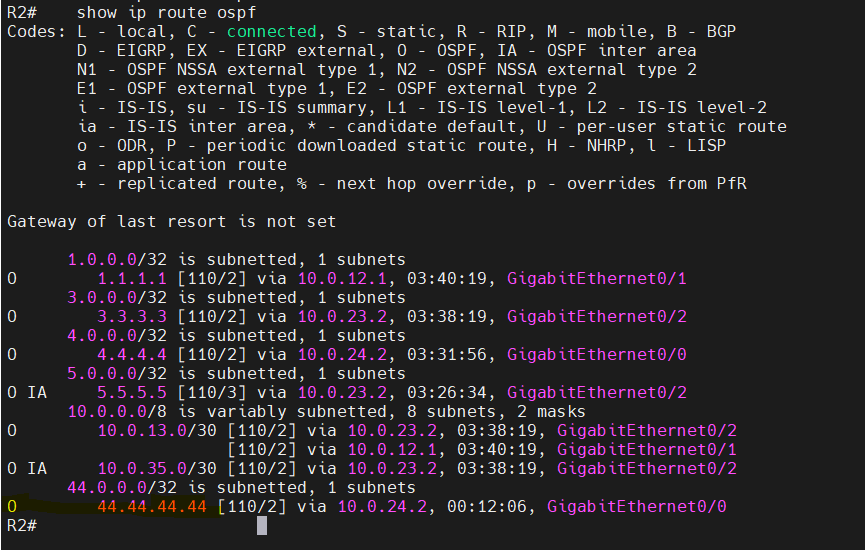

# Multi-Area OSPF LSA Investigation

This lab records packet-level observations from a five-router, multi-area OSPF topology. This write-up documents **Experiment 1: a Type-1 Router-LSA change** only.

## Topology context



R1, R2, and R3 are in Area 0. R2 and R4 are in Area 1, with R2 acting as the Area 0/Area 1 ABR. R3 and R5 are in Area 2, with R3 acting as the Area 0/Area 2 ABR. The experiment changed R4 and observed the R2–R4 Area 1 link. All five routers had FULL OSPF adjacencies before the investigation.

## Experiment 1 — Type-1 Router-LSA

### Objective

Observe how adding an OSPF-advertised loopback to R4 changes R4's Area 1 Router-LSA, how the updated LSA appears in the packet capture, and how R2's routing table reflects the new prefix.

### Change made

Loopback10 was added to R4 with address `44.44.44.44/32` and advertised in Area 1.

### R4 Router-LSA before and after

Before the change, R4's Router-LSA was in Area 1, with Link State ID and Advertising Router `4.4.4.4`, sequence number `0x80000009`, and **2 links**.



After adding and advertising Loopback10, the screenshot shows sequence number `0x8000000B` and **3 links**. The new link is a stub network for `44.44.44.44/32`:

- Link Type: `3` — connection to a stub network
- Link ID: `44.44.44.44`
- Link Data / mask: `255.255.255.255`
- Metric: `1`

The original `4.4.4.4/32` stub and the transit link also remain in the LSA.



| Observation | Before | After |
|---|---:|---:|
| Advertising Router | `4.4.4.4` | `4.4.4.4` |
| Sequence number | `0x80000009` | `0x8000000B` |
| Number of links | 2 | 3 |
| Added link | — | Stub `44.44.44.44/32`, metric 1 |

### Update and acknowledgment in Wireshark

The capture uses the `ospf` display filter. The packet list shows an LS Update from `10.0.24.2` (R4) to `224.0.0.5`, and an LS Acknowledge from `10.0.24.1` (R2) to `224.0.0.5`. The observation notes record the R4 update and R2 acknowledgment, followed by an update containing the new stub-link details and an acknowledgment.


The expanded Router-LSA in the capture shows:

- LS Type: Router-LSA (`1`)
- Link State ID: `4.4.4.4`
- Advertising Router: `4.4.4.4`
- Sequence number: `0x8000000b`
- Length: `60`
- Number of links: `3`
- New stub link: ID `44.44.44.44`, data/mask `255.255.255.255`, metric `1`
- Transit link: ID `10.0.24.1`, data `10.0.24.2`, metric `1`



### Result on R2

R2's routing-table screenshot shows the new OSPF route:

```text
O 44.44.44.44/32 [110/2] via 10.0.24.2, GigabitEthernet0/0
```



### Experiment 1 result

The evidence connects the change on R4 to its updated Type-1 Router-LSA and the route visible on R2:

```text
R4 adds and advertises Loopback10 44.44.44.44/32 in Area 1
        ↓
R4's Area 1 Router-LSA changes (2 links → 3; sequence advances)
        ↓
R4 sends an LS Update; R2 acknowledges it
        ↓
R2's routing table contains O 44.44.44.44/32 via 10.0.24.2
```

## Next experiment

**Placeholder — Type-3 Summary-LSA investigation.** Add the captured evidence and observations after the next experiment is performed. No Type-2 or Type-3 analysis is included yet.
