# Single-Area OSPF: Neighbor Formation After Process Reset

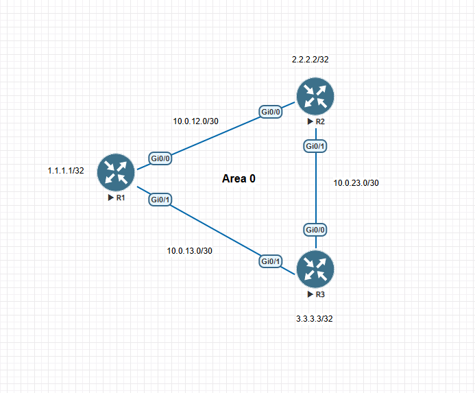

## Objective

Observe how OSPF neighbors re-establish adjacency after the OSPF process is reset. This experiment correlates Cisco IOS adjacency-debug messages with OSPF packets captured in Wireshark.

## Topology

Three routers form a triangle in OSPF Area 0. R1 connects to R2 over 10.0.12.0/30 and to R3 over 10.0.13.0/30. R2 and R3 connect over 10.0.23.0/30. The loopbacks are R1 1.1.1.1/32, R2 2.2.2.2/32, and R3 3.3.3.3/32.

### R1 OSPF process summary

R1's show ip ospf output identifies process 1 and router ID 1.1.1.1. It reports Area BACKBONE (Area 0), three interfaces in the area including one loopback, and six LSAs.

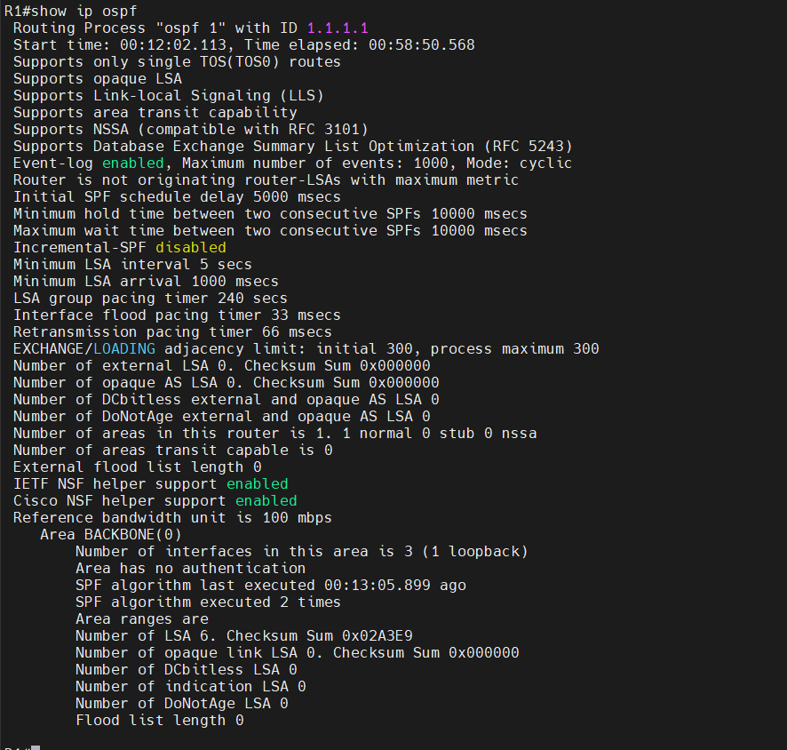

## Steady-state Hello capture

With the adjacency established, the capture shows repeated Hello packets from 10.0.12.1 and 10.0.12.2 to 224.0.0.5. This is the periodic Hello traffic seen before the database synchronization sequence.

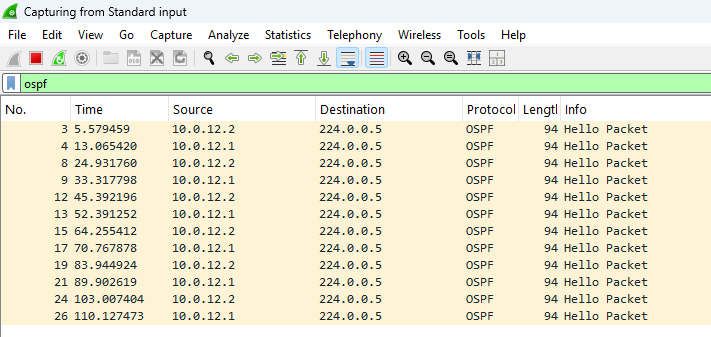

## Procedure

The OSPF adjacencies were FULL and connectivity had been verified before the experiment. A packet capture was started on the R1–R2 link, and OSPF adjacency debugging was enabled on R1. The process was then reset:

    R1# clear ip ospf process
    Reset ALL OSPF processes? [no]: yes

## Observed neighbor-state progression

After the reset, R1 reported both established neighbors moving from FULL to DOWN. As the interfaces returned to OSPF operation, the debug and packet observations showed the neighbors progressing through INIT and 2-Way, followed by database exchange and synchronization.

| Neighbor state | Meaning | Observation in this experiment |
|---|---|---|
| **Down** | No active neighbor relationship is established. | The process reset caused R1's neighbors 2.2.2.2 and 3.3.3.3 to move from FULL to DOWN. |
| **Init** | A Hello has been received from the neighbor, but two-way communication has not yet been confirmed. | INIT was observed during neighbor discovery after the process restarted. |
| **2-Way** | Each router has received a Hello that lists its own router ID, confirming two-way communication. | R1's debug reported 2-Way communication with 2.2.2.2 and 3.3.3.3. DR/BDR election information was also logged. |
| **ExStart** | Routers establish the database-exchange relationship and negotiate DBD sequence details. | The debug and capture show DBD negotiation; R1 is identified as the slave in the displayed exchanges. |
| **Exchange** | Routers exchange DBD summaries to compare their link-state databases. | DBD packets include Type 1 and Type 2 LSA summary information. R1's debug reports exchange completion. |
| **Loading** | Routers request and receive LSAs needed to complete database synchronization. | R1 sends LS Requests and receives LS Updates; the debug then reports synchronization. |
| **Full** | The databases for the adjacency are synchronized. | R1 reports both neighbors synchronized and transitioning from LOADING to FULL. |

On the R1–R2 link, R1's debug identifies R2 (2.2.2.2) as DR and R1 (1.1.1.1) as BDR. On the R1–R3 link, it identifies R3 (3.3.3.3) as DR and R1 (1.1.1.1) as BDR.

## OSPF packet types and their role in the state progression

OSPF uses five packet types. The packets support neighbor discovery and database synchronization; the neighbor states describe the progress of the relationship. A packet type is not itself a neighbor state.

| Packet type | Function | State or stage | Finding from this capture |
|---|---|---|---|
| **Hello** | Discovers neighbors, confirms two-way communication, and maintains neighbor relationships. | Used during Down, Init, and 2-Way progression; periodic Hellos continue after adjacency reaches Full. | R1 sent a Hello from 10.0.12.1 to 224.0.0.5. R2 sent a Hello from 10.0.12.2 to 10.0.12.1; the packet showed R2 as DR and R1 as an active neighbor. |
| **Database Description (DBD)** | Negotiates database exchange and advertises LSA headers for comparison. | ExStart for negotiation; Exchange for database summaries. | Empty DBD packets were captured during negotiation. Subsequent DBDs carried Type 1 and Type 2 LSA summary information. |
| **Link State Request (LSR)** | Requests specific LSAs that are missing or need updating. | Sent after database summaries are compared, during the transition to and work within Loading. | R1 requested Type 1 and Type 2 LSAs. |
| **Link State Update (LSU)** | Delivers requested LSAs and floods updated link-state information. | Used during Loading to complete synchronization and later when updates must be flooded. | R2 sent the requested LSA information; R1's debug recorded receiving an LS Update. |
| **Link State Acknowledgment (LSAck)** | Confirms receipt of LSAs carried in an update. | Acknowledges reliable LSA delivery; it is not a separate neighbor state. | R1 acknowledged the LSAs in the capture. Database synchronization completed and the adjacency reached Full. |

### Wireshark packet sequence after the process reset

The packet list shows Hello packets from both routers followed by database synchronization traffic: DBD, LS Request, LS Update, and LS Acknowledgment. Later rows also show additional Hellos, updates, and acknowledgments.

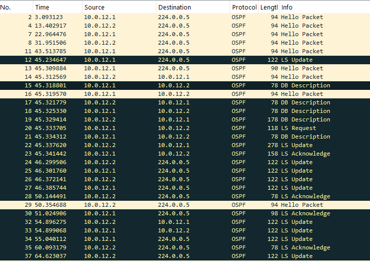

The observed synchronization sequence was:

    Hello → INIT → 2-Way → DBD negotiation (ExStart) → DBD summaries (Exchange)
    → LS Request (Loading) → LS Update → LS Acknowledgment → FULL

## Cisco IOS debug observations

The R1 adjacency debug provides the router-side view of the packet exchange:

- The process reset took both neighbors from FULL to DOWN.
- During discovery, R1 logged INIT and 2-Way progression.
- R1 logged DR/BDR elections on both links.
- DBD negotiation completed with R1 as slave in the displayed exchanges.
- R1 reported Exchange completion, sent LS Requests, received LS Updates, and synchronized with both neighbors.
- The final debug messages show both adjacencies transitioning from LOADING to FULL.

## Final verification

The final evidence shows both OSPF neighbors in FULL state, OSPF routes installed, and the OSPF database populated after convergence.

## Evidence

### OSPF process reset

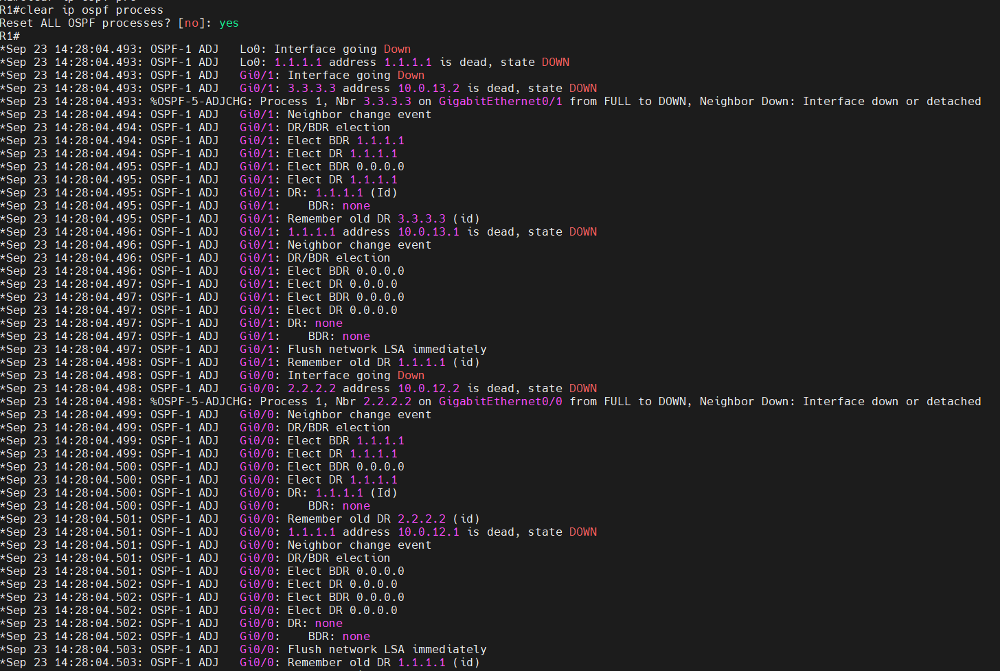

### Cisco adjacency debug

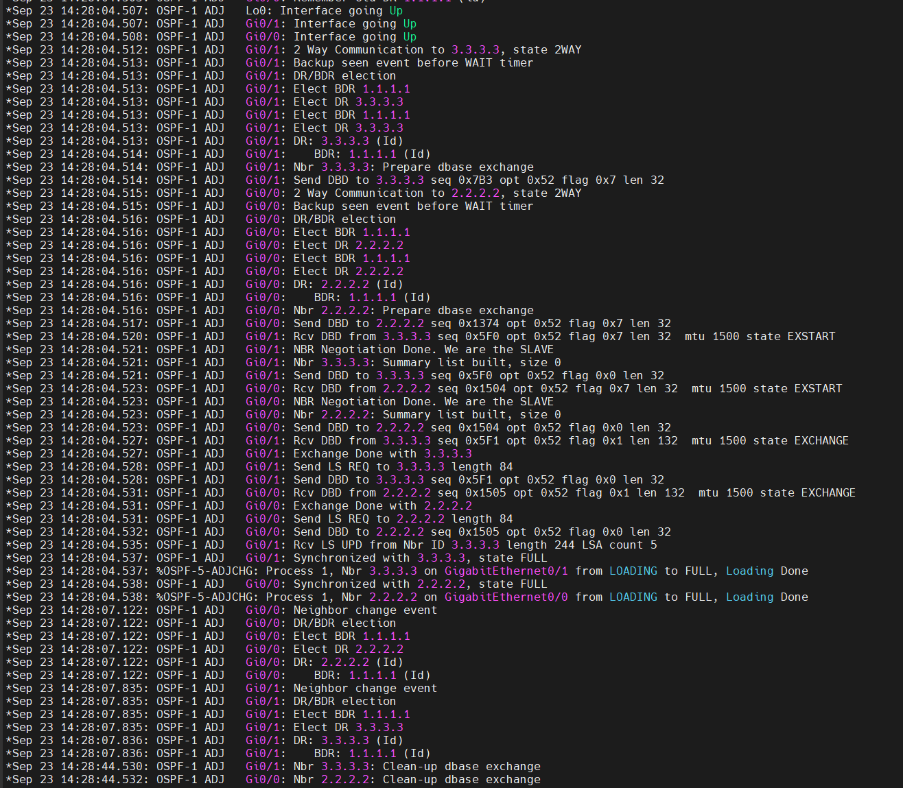

### Database Description packets

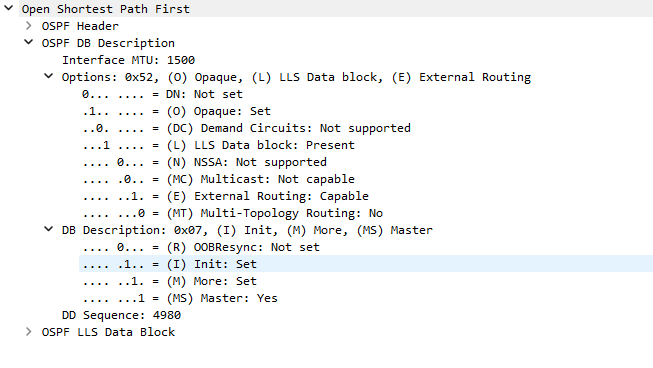

### Link State Request

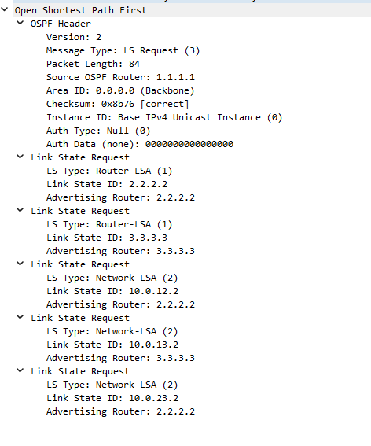

### Link State Update

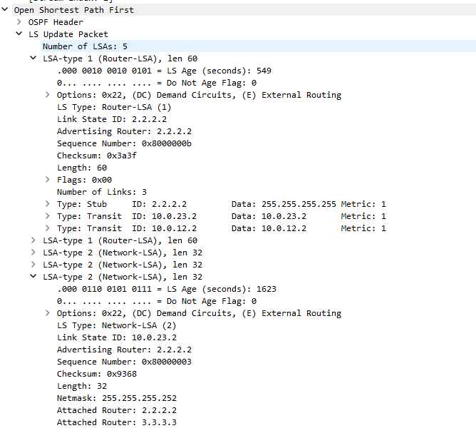

### Link State Acknowledgment

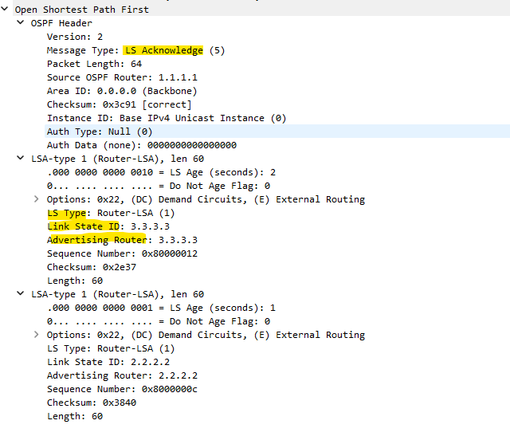

### Final neighbor state

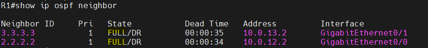

### Final routing table

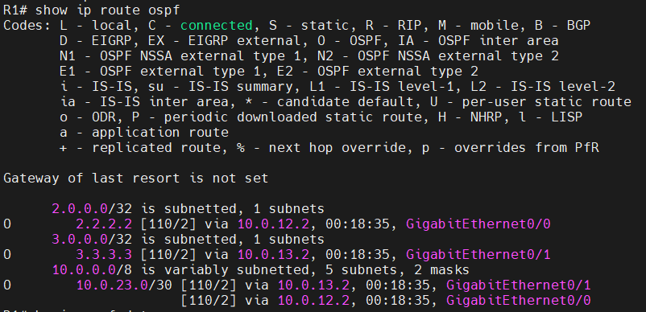

### Final OSPF database

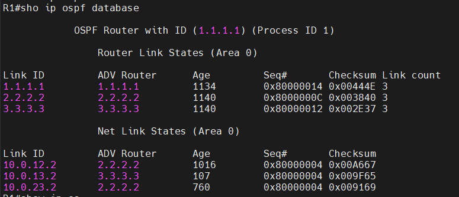

